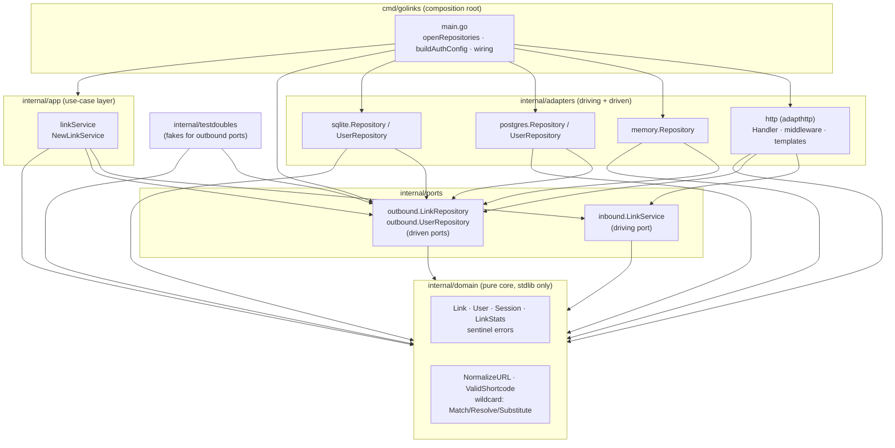

# GoLinks Architecture

## Purpose & context

GoLinks is a self-hosted **go-links** service: short, memorable internal links
(`go/docs`, `go/pulls/10`) that redirect to longer destination URLs, with
per-link click tracking. It ships as a single Go binary with pluggable storage
(in-memory, SQLite, PostgreSQL) and pluggable authentication (`none`, `local`
username/password, `proxy`/SSO header), plus a JSON API and a small HTML admin
UI.

The codebase follows **Hexagonal Architecture (Ports & Adapters)**. The core
business logic (`domain`, `app`) knows nothing about HTTP or SQL; it talks to
the outside world only through port interfaces. Concrete adapters implement
those ports and are wired together in the `cmd/golinks` composition root.

This document reflects the **current, split-ports layout** (interfaces live in
`internal/ports/{inbound,outbound}`), which supersedes the older
[`2026-05-02-overview.md`](2026-05-02-overview.md) description that placed ports
and the service inside `internal/domain`.

## Component & dependency diagram

Every arrow points *inward* (toward the domain). No arrow ever points from an
inner layer out to an outer one.



## Inward dependency rule (enforced)

| Layer | Package(s) | May import |
|---|---|---|
| **domain** | `internal/domain` | stdlib only — nothing internal |
| **ports** | `internal/ports/inbound`, `internal/ports/outbound` | `domain` only |
| **app** | `internal/app` | `domain` + `ports` |
| **adapters** | `internal/adapters/{http,memory,postgres,sqlite}` | `domain` + `ports` + `app` |
| **testdoubles** | `internal/testdoubles` | `domain` + `ports` (implements outbound) |
| **cmd** | `cmd/golinks` | everything (composition root) |

This rule is not just documentation — it is enforced in CI by
[go-arch-lint](https://github.com/fe3dback/go-arch-lint) via
[`.go-arch-lint.yml`](../../.go-arch-lint.yml). See
[Boundary guard](#boundary-guard-go-arch-lint) below.

Note: in the current code, the HTTP adapter depends on `ports` + `domain` (not
on `app`) — it is handed an `inbound.LinkService` by the composition root and
never constructs one. The guard *permits* adapters to import `app` but nothing
requires it.

## Ports & adapters map

### Inbound (driving) port

- **`inbound.LinkService`** — `internal/ports/inbound/service.go`. The single
  driving port. All link business rules are behind it:
  `CreateLink`, `GetLink`, `UpdateLink`, `DeleteLink`, `ListLinks`,
  `RedirectLink`, `GetLinkStats`.
  - **Implemented by:** `app.linkService` (`internal/app/link_service.go`),
    constructed via `app.NewLinkService(repo outbound.LinkRepository)`.
  - **Consumed by:** `adapthttp.Handler` (`internal/adapters/http/handler.go`).

### Outbound (driven) ports

- **`outbound.LinkRepository`** — `internal/ports/outbound/repositories.go`.
  Persistence for links: `CreateLink`, `GetLink`, `UpdateLink`, `DeleteLink`,
  `ListLinks`, `IncrementClickCount`, `GetStats`, `Close`.
- **`outbound.UserRepository`** — same file. Persistence for users:
  `CreateUser`, `GetUserByUsername`, `CountUsers`, `Close`.

Both outbound ports are implemented by each storage adapter:

| Adapter (package) | File | Implements |
|---|---|---|
| `memory` (`memory.Repository`) | `internal/adapters/memory/repository.go` | `LinkRepository` + `UserRepository` (one struct) |
| `postgres` (`postgres.Repository`, `postgres.UserRepository`) | `internal/adapters/postgres/repository.go` | `LinkRepository`, `UserRepository` |
| `sqlite` (`sqlite.Repository`, `sqlite.UserRepository`) | `internal/adapters/sqlite/repository.go` | `LinkRepository`, `UserRepository` |
| `testdoubles` (`FakeLinkRepository`, `FakeUserRepository`) | `internal/testdoubles/deps.go` | function-field fakes of both, for unit tests |

The driven adapters return **domain sentinel errors** (`domain.ErrNotFound`,
`domain.ErrAlreadyExists`) so the app and HTTP layers can branch on them
without knowing the backend.

## Key request flows

### Create a link — `POST /api/links`

1. `adapthttp.Handler.CreateLink` (`internal/adapters/http/handler.go`) decodes
   the JSON `CreateLinkRequest` and reads the authenticated owner from the
   request context (`UserFromContext`, set by the `RequireAuth` middleware).
2. It calls `h.svc.CreateLink(shortcode, url, description, owner)` on the
   `inbound.LinkService`.
3. `app.linkService.CreateLink` applies the business rules — all via pure
   `domain` helpers: `domain.NormalizeShortcode`, then `domain.ValidShortcode`
   or (for `*` codes) `domain.ValidWildcardShortcode`, a wildcard/destination
   `*`-parity check, and destination normalization through
   `domain.NormalizeURL` / `domain.NormalizeWildcardURL`.
4. On success it builds a `domain.Link` and calls
   `s.repo.CreateLink(link)` on the `outbound.LinkRepository` (the wired
   backend). A duplicate shortcode surfaces as `domain.ErrAlreadyExists`.
5. The handler maps the result: `ErrAlreadyExists` → `409`, other validation
   errors → `400`, success → `201` with a `LinkResponse` JSON body.

### Resolve a redirect — `GET /{shortcode}`

1. `adapthttp.Handler.Redirect` extracts the (possibly multi-segment, via the
   `{shortcode:.+}` route) path and calls `h.svc.RedirectLink(shortcode)`.
2. `app.linkService.RedirectLink`:
   - **Exact match first:** `repo.GetLink(shortcode)`. If found and the stored
     shortcode is *not* itself a wildcard pattern, it increments the click
     count (`incrementClicks` → `repo.IncrementClickCount`, synchronous, errors
     logged not fatal) and returns the link.
   - **Wildcard fallback:** otherwise it loads `repo.ListLinks()` and calls
     `domain.ResolveWildcard` (longest-literal-prefix wins, ties broken
     lexicographically), then `domain.SubstituteWildcard` to inject the
     percent-escaped captured segment into the destination template. Click
     count is recorded against the *pattern* link.
   - No match → `domain.ErrNotFound`.
3. The handler issues a `302` to `link.URL` on success. On `ErrNotFound` it
   redirects to `/admin?new=<shortcode>` (a create-link affordance for a
   logged-in admin; anonymous users get bounced to `/login` by the middleware).

## External integrations & design decisions

- **HTTP router:** `github.com/gorilla/mux`. Routes are declared in
  `Handler.RegisterRoutes`; the greedy `{shortcode:.+}` matcher supports
  multi-segment wildcard links, with `/stats` registered before the bare item
  route so it isn't swallowed.
- **PostgreSQL driver:** `github.com/lib/pq` (`database/sql`). Schema is created
  idempotently on startup (`CREATE TABLE IF NOT EXISTS`, additive `ALTER`).
- **SQLite driver:** `github.com/mattn/go-sqlite3` (cgo). Single-binary/embedded
  deployments.
- **Password hashing:** `golang.org/x/crypto/bcrypt` (used by the SQL adapters
  and the local-auth login/register handlers).
- **Storage selection** is a runtime decision in the composition root
  (`openRepositories`), keyed off the `DATABASE_URL` scheme
  (`postgres://` / `postgresql://`, `sqlite://`, or unset → in-memory). Adding a
  backend means implementing the two outbound ports in a new
  `internal/adapters/<name>/` package and adding a case here — no change to
  `domain`, `app`, or `http`.
- **Auth** is middleware in the HTTP adapter (`RequireAuth`), configured from
  env in `buildAuthConfig`. Modes: `none`, `local` (HMAC-signed session cookie
  + optional bearer API key), `proxy` (trusted-header SSO). The domain and app
  layers are unaware of auth; the owner is passed in as a plain string.
- **Observability:** structured logging via `log/slog` to stderr (text handler),
  set up in `main`. No metrics endpoint today.
- **Graceful shutdown & timeouts:** `newServer` sets explicit
  Read/Write/Idle/ReadHeader timeouts; `runServer` traps SIGINT/SIGTERM and
  drains in-flight requests with a 15s shutdown context.

## Boundary guard (go-arch-lint)

The inward dependency rule is machine-checked by
[`.go-arch-lint.yml`](../../.go-arch-lint.yml) (config `version: 3`) using
`github.com/fe3dback/go-arch-lint@v1.16.0`. Components map 1:1 onto the package
layout — `domain`, `ports-inbound`, `ports-outbound`, `app`, `adapters`, `cmd`,
`testdoubles` — and each component's `mayDependOn` encodes the table above.
`allow.depOnAnyVendor: true` scopes the guard to *internal* dependencies only
(third-party/stdlib imports are unrestricted). Run it locally with:

```bash
go install github.com/fe3dback/go-arch-lint@v1.16.0
go-arch-lint check
```

CI runs the same check in the `lint` job of
[`.github/workflows/ci.yml`](../../.github/workflows/ci.yml).

### Known scoping decisions

- **Adapters are a single component.** Sibling adapters (`memory`, `postgres`,
  `sqlite`, `http`) live under one `adapters` component, so the guard does not
  by itself forbid one adapter importing another. That "adapters are siblings,
  not dependents" rule (see `AGENTS.md` invariants) currently holds by
  convention; the code does not violate it. Splitting into per-adapter
  components is a possible future tightening.
- **Test files are excluded** (`excludeFiles: .*_test\.go$`). External test
  packages (e.g. `package app_test`) legitimately import their own package
  under test, which the guard would otherwise flag as a self-dependency. The
  rule governs production wiring, so test files are out of scope. No real
  boundary violations were found in production code.

## Deployment

- **Image:** `ghcr.io/gjcourt/golinks`, built and pushed by
  `.github/workflows/image.yml` on every push to `master` (multi-arch
  `linux/amd64,linux/arm64`, authenticated with the built-in `GITHUB_TOKEN`).
  Each build publishes `YYYY-MM-DD`, an immutable `YYYY-MM-DD-<sha7>`, and
  `latest`.
- **Homelab pin:** deployments pin the immutable `YYYY-MM-DD-<sha7>` tag. The
  pin itself lives **outside this repo**, in the homelab GitOps tree at
  `homelab/apps/base/golinks/deployment.yaml` (relative to the homelab repo);
  image-tag bumps there must be coordinated with builds published from here.
  See `AGENTS.md` → "Container image" for the full tag scheme and the
  first-build GHCR gotcha.
